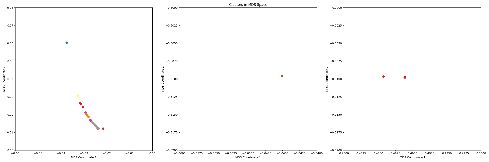
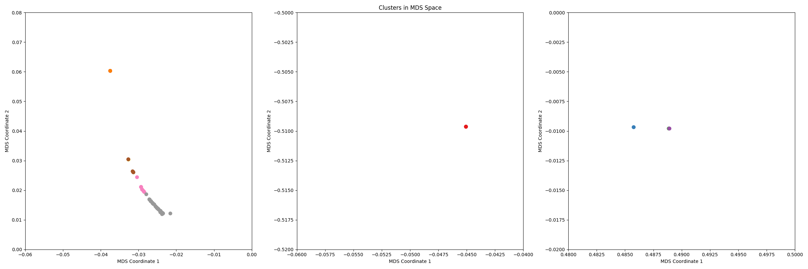

# HW2

[](https://travis-ci.org/david-joy/bmi203-hw2)

David Joy 2/7/2017<br/>
BMI 203<br />
Winter 2017<br />
Homework Assignment #2 <br />

## Questions

### Explain your similarity metric, and why it makes sense biologically.

The similarity metric I chose is a modified variant of Comparison of Protein Active Site Structures (CPASS [1]). This algorithm is used as a search metric to query large protein-ligand binding databases to aid in drug discovery. It has the advantage of being relatively fast to compute and requiring relatively little information about the protein structure.

The metric sums the distances between alpha carbons on both active sites, weighted by their probability of substitution using the BLOSUM62 [2] substitution score. This effectively aligns the active sites, so sites with closely positioned amino acids with similar properties score highly. If either of the shape of the site or the chemical properties of residues changes, the score drops, taking into account both the shape and electronic properties of active sites.

As originally designed, the CPASS also uses information about the relative location of residues with respect to the ligand to try and determine which active site residues are most critical. Unfortunately, we don't have this information, so as a substitute, the score is weighted by the probability that a given residue is the key catalytic residue as determined by a review of a large database of eukaryotic catalytic domains [3].

By combining these three measures, CPASS quickly allows comparison of key active site properties: shape, chemistry, and ligand interaction and is hence a sensible metric to use to cluster domains.

The modified CPASS algorithm is implemented in [compute_similarity()](https://github.com/david-joy/bmi203-hw2/blob/master/hw2/cluster.py#L179)<br/>

Tests for CPASS are implemented in [test_compute_similarity()](https://github.com/david-joy/bmi203-hw2/blob/master/test/test_cluster.py#L72)<br />

### Explain your choice of partitioning algorithm.

The partitioning algorithm I chose is Affinity propagation [4]. Affinity propagation partitions collections of points by attempting to determine exemplar points that can be used to represent a large number of follower points. These exemplars slowly take responsibility for unclaimed points until all available points are exhausted.

Unlike most partitioning algorithms, Affinity propagation doesn't require selecting a number of clusters in advance. Instead, it initially connects all points together, then slowly down weights links that have poor affinity for each other until the graph effectively disconnects when all points are assigned to an exemplar. It does require setting a relaxation parameter (called `decay` in this implementation) that determines how much each round decreases linkage, but the resulting clustering is only somewhat sensitive to the choice of weight.

Affinity propagation also has the advantage that it only requires pairwise similarities between points, so can use the CPASS score directly instead of converting it into a distance.

Projecting the clusters into 2D gives the following clustering<br />

<br />

Affinity propagation is implemented in [cluster_by_partitioning()](https://github.com/david-joy/bmi203-hw2/blob/master/hw2/cluster.py#L337)<br/>

Tests for Affinity propagation are implemented in [test_partition_clustering()](https://github.com/david-joy/bmi203-hw2/blob/master/test/test_cluster.py#L123)<br />

### Explain your choice of hierarchical algorithm.

The hierarchical algorithm I chose was Macnaughton-Smith divisive clustering [5]. This algorithm recursively splits clusters using a splintering algorithm where the furthest point from the cluster is split off, then a new cluster built around it. This procedure continues until a split fails, at which point this implementation uses the old cluster as the leaf in the hierarchy.

I chose Macnaughton-Smith because it seemed likely to produce small, tightly grouped clusters which are prefered by most cluster evaluation metrics.

Like many clustering algorithms, Macnaughton-Smith seems to be easier to implement on a metric space where the features of an 'average' ActiveSite can be calculated. As a search algorithm, CPASS only outputs a similarity measure, so to convert active sites into a coordinate space, the multidimensional scaling algorithm (MDS) [6] was used to project active sites onto a Euclidean space.

Projecting the clustering into 2D gives the following clustering<br />

<br />

Macnaughton-Smith is implemented in [cluster_hierarchically()](https://github.com/david-joy/bmi203-hw2/blob/master/hw2/cluster.py#L458)<br/>

The binary split tree used by the algorithm is implemented in [MSCluster()](https://github.com/david-joy/bmi203-hw2/blob/master/hw2/cluster.py#L36)<br />

Multidimensional scaling is implemented in [multidimensional_scaling()](https://github.com/david-joy/bmi203-hw2/blob/master/hw2/cluster.py#L282)<br/>

Tests for Affinity propagation are implemented in [test_hierarchical_clustering()](https://github.com/david-joy/bmi203-hw2/blob/master/test/test_cluster.py#L145)<br />

### Explain your choice of quality metric. How did your clusterings measure up?

After comparing several metrics, the quality metric I used to evaluate the quality of a cluster was the silhouette coefficient. This measure outputs a ratio for each point in the dataset, with 1 indicating perfect membership in a cluster and -1 indicating perfect failure to properly classify.<br />

Partitioning Worst Scores:<br />

PDB File | Silhouette Score
--- | ---
27031 | -0.9999895386759475
82238 | -0.9999542247742778
56394 | -0.9999362806093184
29773 | -0.9999352567972768
10814 | -0.9999305968582025
24634 | -0.9998975374036783
25878 | -0.9998767597461782
88042 | -0.9998148782928179
37224 | -0.9998031657088653
8304 | -0.9997449761731477

Partitioning Best Scores:<br />

PDB File | Silhouette Score
--- | ---
69893 | 0.9999775161141842
39117 | 0.9999808014694177
8208 | 0.9999905685700978
94372 | 0.9999905687345383
34958 | 0.9999923866055261
35014 | 0.9999956684218239
18773 | 0.9999999999966923
34088 | 0.9999999999966923
63634 | 0.9999999999997028
57481 | 0.9999999999997282

Partitioning Average Silhouette: **-0.20788681180961868**<br />

Hierarchical Worst Scores:<br />

PDB File | Silhouette Score
--- | ---
42202 | -0.46435378723386633
68578 | -0.1591798011532478
93192 | 0.07592638390915907
71389 | 0.08521480672848221
38031 | 0.08644228342589541
27312 | 0.23136321983333805
85492 | 0.2996347856384997
63634 | 0.30124196172483936
57481 | 0.30124196172483936
91911 | 0.39567813717727085

Hierarchical Best Scores:<br />

PDB File | Silhouette Score
--- | ---
63064 | 0.9811694750951921
46975 | 0.9828569817484542
17622 | 0.9872473646907997
94719 | 0.9948516810621713
50362 | 0.998002434680269
52954 | 0.998010383458227
65815 | 0.9984152181096972
13052 | 0.998420214753935
42633 | 0.9999396494940707
57602 | 0.9999396567775125

Hierarchical Average Silhouette: **0.7897938656869258**<br />

Because both these metrics prefer small, tight clusters, they like the clusters created by Macnaughton-Smith better than the larger clusters from affinity propagation. In contrast, affinity propagation is able to create clusters that perfectly fit the silhouette score, whereas Macnaughton-Smith averages out the silhouette score more.<br />

The silhouette index is implemented in [silhouette_index()](https://github.com/david-joy/bmi203-hw2/blob/master/hw2/metrics.py#L165).<br/>

In addition to the average silhouette score, I also used the Davies-Bouldin index, which gives an overall score for how well the clusterings divide the dataset. I also considered the Dunn index, but it gave extremely high values when presented with nearly identical clusterings, making averaging difficult.<br />

Partitioning Davies-Bouldin Index: **543.4076450759554**<br />
Hierarchical Davies-Bouldin Index: **4.187364503853873**<br />

As with average silhouette, Davies-Bouldin prefers Macnaughton-Smith because it creates smaller, tighter clusters.<br />

The Davies-Bouldin index is implemented in [davies_bouldin_index()](https://github.com/david-joy/bmi203-hw2/blob/master/hw2/metrics.py#L83)

### Explain your function to compare clusterings. How similar were your two clusterings using this function?

To compare the two clusterings, I calculated the agreement between the two clustering algorithms, taking the other clustering as ground truth.<br />

Partitioning given Hierarchical True: **0.19903846153846153**<br />
Hierarchical given Partitioning True: **0.08345238095238096**<br />

Since perfect agreement corresponds to 1.0 and perfect disagreement is 0.0, this means that the algorithms mostly disagree. This is due to the difference in the number of clusters produced by affinity propagation (13) and the number produced by Macnaughton-Smith (35).<br />

Pairwise agreement is implemented in [pairwise_agreement()](https://github.com/david-joy/bmi203-hw2/blob/master/hw2/metrics.py#L248)

### Did your clusterings have any biological meaning?

The clusters find proteins with very similar sequences such as 276 and 1806. Due to the lack of ligand binding data, CPASS seems to mostly group active sites by similar sequence regardless of algorithm. Hierarchical clustering produces small groups that are very close in sequence space, while affinity propagation had trouble finding clusters that had any obvious biological meaning.

## Structure

The code for both affinity propagation and Macnaughton-Smith divisive clustering along with supporting functions are in `cluster.py`. Implementations of several cluster quality metrics are in `metrics.py` with tests in `test_cluster.py` and `test_metrics.py`.

```
.
├── README.md
├── data
│   ...
├── hw2
│   ├── __init__.py
│   ├── __main__.py
│   ├── cluster.py
│   ├── io.py
│   ├── utils.py
│   └── metrics.py
└── test
    ├── test_cluster.py
    ├── test_metrics.py
    └── test_io.py
```

## usage

To use the package, first run

```
conda install --yes --file requirements.txt
```

to install all the dependencies in `requirements.txt`. Then the package's
main function (located in `hw2/__main__.py`) can be run as
follows

```
python -m hw2 -P data test.txt
```

In particular, to generate `partition.txt` do

```
python -m hw2 -P data partition.txt
```

And to generate `hierarchy.txt` do

```
python -m hw2 -H data heirarchy.txt
```

## testing

Testing is as simple as running

```
python -m pytest
```

from the root directory of this project.


## contributors

Original design by Scott Pegg. Refactored and updated by Tamas Nagy.


## References

`[1] Powers, R., Copeland, J.C., Germer, K., Mercier, K.A., Ramanathan, V.,
    and Revesz, P. (2006). Comparison of protein active site structures for
    functional annotation of proteins and drug design. Proteins: Structure,
    Function, and Bioinformatics 65, 124–135.`<br />
`[2] Henikoff, S., and Henikoff, J.G. (1992). Amino acid substitution matrices from
    protein blocks. Proceedings of the National Academy of Sciences 89,
    10915–10919.`<br />
`[3] Kumar, S., Kumar, N., and Gaur, R.K. (2011). Amino acid frequency
    distribution at enzymatic active site. IIOABJ 2, 23–30.`<br />
`[4] Frey, B.J., and Dueck, D. (2007). Clustering by passing messages between
    data points. Science 315, 972–976.`
`[5] Macnaughton-Smith, P., Williams, W., Dale, M., and Mockett, L. (1964).
    Dissimilarity analysis: a new technique of hierarchical sub-division.
    Nature 202, 1034–1035.`<br />
`[6] Borg, I., and Groenen, P.J.F. (2005). Modern multidimensional scaling:
    theory and applications (New York: Springer).`<br />
